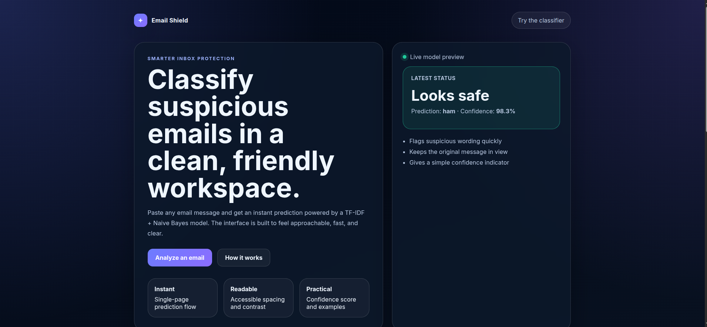
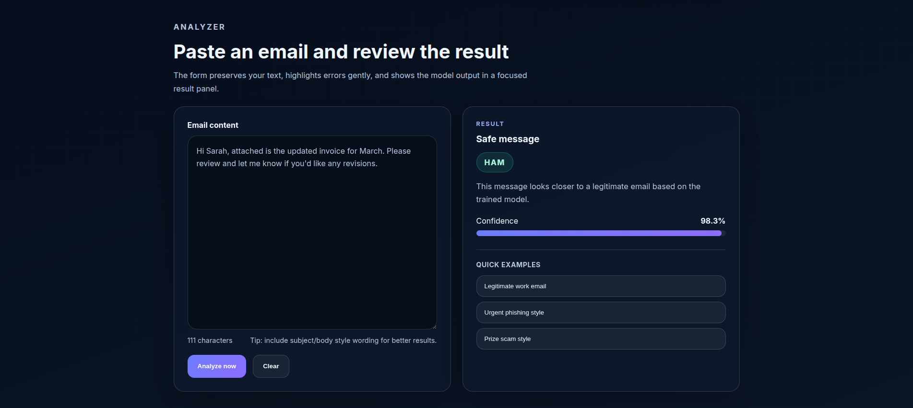

# Email Shield

Email Shield is a lightweight Flask web app that classifies email text as **Spam** or **Ham** using a classic NLP pipeline:

- text cleaning
- TF-IDF vectorization
- Multinomial Naive Bayes classification

It is designed to be simple, fast to run locally, and easy to extend.

## Preview




## Features

- Clean single-page UI for quick testing
- Spam/Ham prediction with optional confidence score
- Automatic model regeneration if `model.pkl` is missing or in an old format
- Minimal dependency footprint
- Straightforward training and inference scripts

## Project Layout

```text
.
├── app.py                  # Flask app + inference flow
├── clean_text.py           # Text preprocessing helper
├── email.csv               # Training dataset
├── model.pkl               # Saved model artifacts (generated)
├── preparing_data.ipynb    # Notebook for exploration/prep
├── README.md
├── requirements.txt
├── train_model.py          # Training + model persistence
├── static/
│   ├── app.js
│   ├── styles.css
│   └── images/
└── templates/
    └── index.html
```

## How the Pipeline Works

1. User submits email content through the form.
2. `clean_text.py` normalizes text by removing links, emails, digits, punctuation, and extra spaces.
3. A `TfidfVectorizer` converts text to feature vectors.
4. `MultinomialNB` predicts the class (`spam` / `ham`).
5. If available, `predict_proba` provides a confidence score shown in the UI.

## Tech Stack

- **Backend:** Flask
- **ML:** scikit-learn (`TfidfVectorizer`, `MultinomialNB`)
- **Data:** pandas
- **Frontend:** HTML, CSS, vanilla JavaScript

## Quick Start (Linux/macOS)

### 1) Create and activate a virtual environment

```bash
python3 -m venv .venv
source .venv/bin/activate
```

### 2) Install dependencies

```bash
pip install -r requirements.txt
```

### 3) Train the model

```bash
python3 train_model.py
```

This generates `model.pkl` containing:

- `model`: trained Naive Bayes classifier
- `vectorizer`: fitted TF-IDF vectorizer

### 4) Run the web app

```bash
python3 app.py
```

Open: <http://127.0.0.1:5000>

## Windows Quick Start

```powershell
python -m venv .venv
.venv\Scripts\activate
pip install -r requirements.txt
python train_model.py
python app.py
```

## Model Artifact Compatibility

If `app.py` finds that `model.pkl` is missing or does not contain both `model` and `vectorizer`, it automatically retrains from `email.csv` and saves fresh artifacts.

## Dataset Notes

The training script expects `email.csv` to include at least:

- `Message` (email text)
- `Category` (label, e.g. `spam` or `ham`)

## Common Commands

Retrain model after dataset update:

```bash
python3 train_model.py
```

Run app in debug mode (already enabled in `app.py`):

```bash
python3 app.py
```

## Troubleshooting

### App starts but prediction fails

Rebuild artifacts:

```bash
python3 train_model.py
```

### Import or package errors

Ensure the venv is active, then reinstall:

```bash
pip install -r requirements.txt
```

### Empty input warning in UI

The app validates input and requires meaningful text after cleaning.

## Roadmap Ideas

- Add evaluation metrics (accuracy, precision, recall, F1)
- Compare multiple classifiers (LogReg, Linear SVM, etc.)
- Add tests for `clean_text()` and inference behavior
- Export predictions/history to a lightweight database
- Add containerization (Docker) and production serving (Gunicorn)

## License

MIT license
